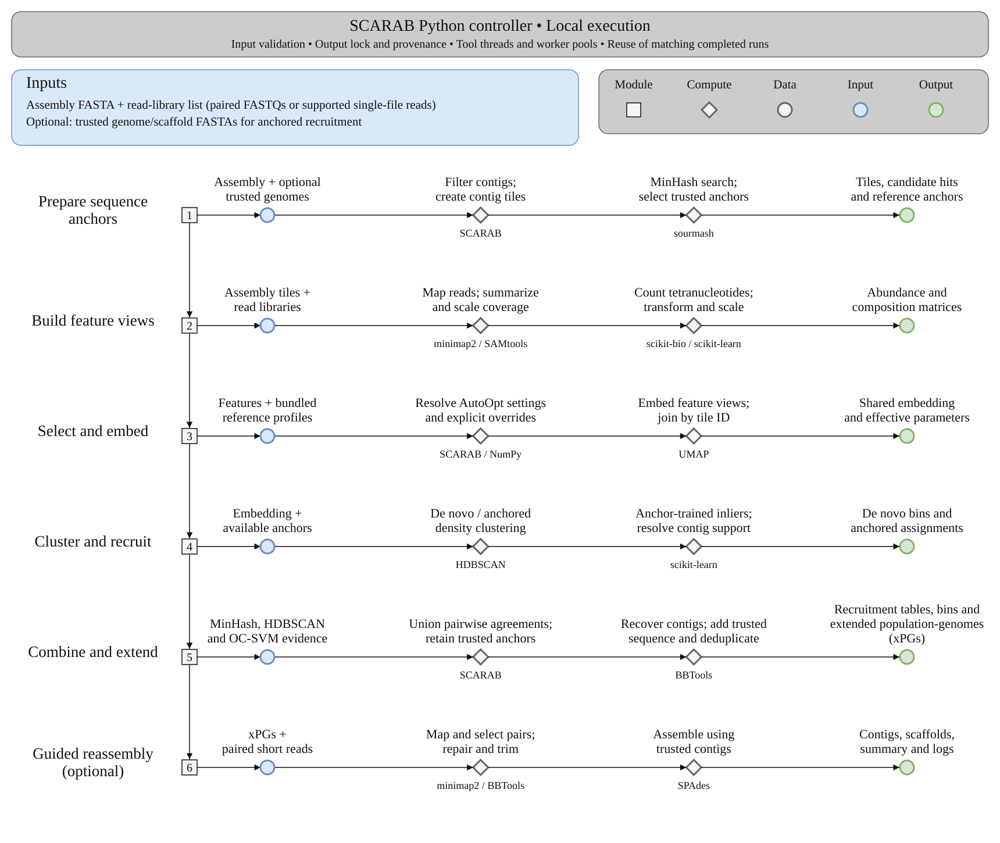

# SCARAB

SCARAB recruits and bins metagenomic contigs using sequence composition, read abundance, and optional trusted genomes such as SAGs. It produces extended partial genomes (xPGs) and supports optional guided reassembly in the same environment.

**[Read the full user guide on Read the Docs](https://hallamlab-scarab.readthedocs.io/)**

## Quick start

Install a released package with Mamba:

```bash
mamba create -n scarab -c conda-forge -c bioconda -c hallamlab scarab
mamba activate scarab
scarab recruit --help
```

Version 1.0.0 is being validated; Anaconda and Quay publication is pending. The user guide covers source installation, Docker, Apptainer, and the reviewer dataset.

With the reviewer dataset downloaded and extracted:

```bash
cd demo
scarab recruit -m k12.gold_assembly.fasta -l read_list.txt -s SAG -o SCARAB_out -t 4
```

## Workflow

[](https://hallamlab-scarab.readthedocs.io/)

For input preparation, parameters, outputs, guided reassembly, and HPC execution, see the **[user guide](https://hallamlab-scarab.readthedocs.io/)**.

[Report issues or request features](https://github.com/hallamlab/SCARAB/issues). Documentation source is maintained in `docs/`.
