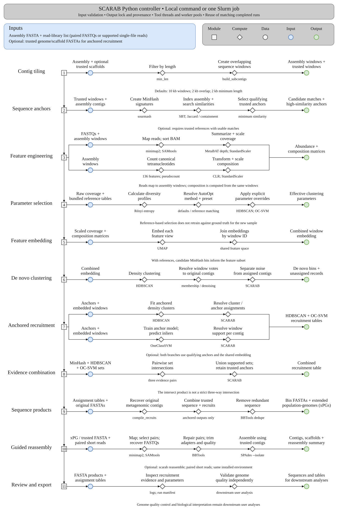

# SCARAB workflow

```{container} primary-workflow
[](assets/workflow-main.svg)
```

[Download SVG](assets/workflow-main.svg) · [Download PDF](assets/workflow-main.pdf)

## Conceptual overview

[](assets/diagrams/conceptual.svg)

[Zoom diagram](assets/diagrams/conceptual.svg) · [Mermaid source](diagrams/conceptual.mmd)

## Software architecture

[](assets/diagrams/architecture.svg)

[Zoom diagram](assets/diagrams/architecture.svg) · [Mermaid source](diagrams/architecture.mmd)

## Detailed data flow

[](assets/diagrams/data-flow.svg)

[Zoom diagram](assets/diagrams/data-flow.svg) · [Mermaid source](diagrams/data-flow.mmd)

The Python controller executes these stages in sequence; the parallel branches in the data-flow diagram describe contributing evidence, not independent Nextflow jobs. With trusted references, MinHash candidates inform the feature subset and high-similarity hits provide anchors. Without usable anchors, de novo processing can continue without anchored products. See [parameters](parameters.md), [outputs](outputs.md), and [citations](citations.md).
## What the workflow reconstructs

SCARAB combines an assembled metagenome, read-derived abundance, sequence
composition and optional trusted scaffolds to recruit metagenomic contigs.
Trusted inputs can be SAGs or another curated genome representation. They
provide anchors for a target population; their presence does not establish
that every recruited contig belongs to the same biological strain.

`scarab recruit` returns contig sets and extended partial genomes (xPGs).
`scarab reassemble` is a separate, optional step that recruits paired short
reads to those sequences and builds guided assemblies. Neither step assigns
formal genome-quality categories. Evaluate completeness, contamination,
chimerism, strain variation and sequence support downstream.

## Follow the evidence through recruitment

### 1. Sequence windows and identifiers

The controller validates the assembly, read manifest and optional trusted
FASTA inputs before starting work. It records input paths, sizes, modification
times, settings and software version. One output directory belongs to one
configuration; an output lock prevents overlapping runs from writing into it.

Assembly and trusted sequences are length-filtered and tiled. Defaults are
10,000-bp windows, 2,000-bp overlap and a 2,000-bp minimum. The overlap option is
not a 2,000-bp step size. End windows can overlap more than the nominal amount
because the implementation retains a terminal window. Window identifiers map
back to original contigs for final FASTA extraction.

### 2. MinHash candidates and trusted anchors

With references, sourmash builds signatures for trusted windows and indexes
qualifying original metagenome contigs in a sequence Bloom tree. The default
k-mer size is 201. The search collects Jaccard and containment results in the
legacy `jacc_sim` field. Consequently, a value of one can mean complete
containment; it does not establish genome-wide identity.

SCARAB distinguishes the broader set of candidate MinHash matches from hits
meeting the configured minimum similarity. Candidate contigs inform the
feature subset; qualifying hits establish anchors for trusted recruitment.
If there are no candidate matches, feature embedding uses the available
assembly windows. Without qualifying anchors, anchored products are absent
and de novo processing can continue.

### 3. Coverage and composition features

minimap2 maps every supplied read library to the assembly windows. SAMtools
processes alignments and MetaBAT's depth summarizer creates coverage features;
SCARAB does not run MetaBAT's binning algorithm. Multiple libraries provide
multiple coverage measurements for the same assembly, rather than separate
assemblies or separate SCARAB runs. Coverage features are standardized.

Sequence composition uses 136 canonical tetranucleotide features, including
pseudocount handling, normalization, centered log-ratio transformation and
standardization. UMAP embeds coverage and composition separately, then the
controller joins those embeddings by window identifier. Preserve the feature
and assignment tables when tracing an unexpected recruitment decision.

### 4. Parameter selection

The abundance matrix also supplies Rényi entropy profiles for parameter
selection. AutoOpt relates the new dataset to bundled reference profiles and
calibrated parameter tables; it is not a fresh ground-truth optimization of
the user's metagenome. The CLI supports `algo_defaults`, `majority_rule`,
`best_cluster` and `best_match`. The research comparison labelled
`sample_type` is not a fifth public AutoOpt mode.

Precision/recall presets express the objective used during calibration.
They do not guarantee strain purity, completeness or a fixed error rate on
new data. Explicit numerical overrides are applied after parameter selection.
The [parameter guide](parameters.md) describes how AutoOpt and strictness
flags interact, including the effective defaults recorded in the log.

### 5. Density clustering and anchored recruitment

HDBSCAN produces de novo window assignments, membership information and noise
labels. The denoising logic resolves window-level evidence to original contigs;
noise is retained in diagnostic tables and is not exported as a genome bin.

When anchors are available, a separate anchored HDBSCAN fit and anchor-to-cluster
resolution produce density-based recruits. OC-SVM trains on embedded windows
from anchor-associated metagenomic contigs, predicts inlier windows, and
summarizes support per original contig. These are complementary evidence
sources, not independent demonstrations of taxonomic identity.

### 6. Combined evidence and sequence products

The `intersect` name is historical. For a target, let M be its broader MinHash
candidate set, H its anchored HDBSCAN assignments, S its OC-SVM assignments,
and A its qualifying high-similarity anchors. The implemented combination is:

```text
combined = (M ∩ H) ∪ (M ∩ S) ∪ (H ∩ S) ∪ A
```

This is pairwise agreement plus retained anchors, not a strict intersection
of all three sets. Inspect the component assignments alongside the combined
output when comparing recruitment strategies.

The compiler retrieves original assembly contigs for de novo, HDBSCAN, OC-SVM
and combined products. Anchored xPG products additionally include trusted
reference sequence and use BBTools deduplication with a 97% minimum-identity
setting. They are not newly assembled sequences until the optional reassembly
command is run. See [outputs](outputs.md) for filenames and distinctions.

## Guided reassembly

[Guided reassembly](reassembly.md) accepts one FASTA or a directory of FASTAs
and the same short-read manifest format. Each target is processed separately:
map reads → retain primary paired alignments with both mates mapped → recover
paired FASTQs → repair pairs → trim adapters and low-quality sequence → run
SPAdes in isolate mode with the input sequence as trusted contigs.

The installed environment contains all these tools. Reassembly is explicitly
invoked and does not run implicitly during `recruit`. Downstream genome QC,
functional annotation and comparative analyses remain separate user analyses.

## Controller and source map

The Python controller calls stages in order. The diagram's evidence branches
do not represent a Nextflow scheduler. Native-tool threads and selected worker
pools use the requested resources; a Slurm submission wraps the whole command.
Reassembly processes targets one at a time, assigning the requested threads
to the active target. See [resources and reruns](resources.md).

| Responsibility | Source |
|---|---|
| CLI dispatch and recruitment orchestration | `src/scarab/__main__.py`, `commands.py` |
| Validation, locking, run provenance | `src/scarab/validation.py` |
| Tiling, transformations, AutoOpt resolution | `src/scarab/utilities.py`, `entropy.py`, `configs/` |
| MinHash index and searches | `src/scarab/minhash_recruiter.py` |
| Read abundance and composition | `src/scarab/abundance_recruiter.py`, `tetranuc_recruiter.py` |
| Embeddings, clustering, anchor evidence | `src/scarab/clusterer.py` |
| Recruitment FASTAs and xPG compilation | `src/scarab/compile_recruits.py` |
| Guided assembly, resource flags, summary | `src/scarab/reassemble.py` |

Cite the methods actually used, using the [software citation guide](citations.md).
